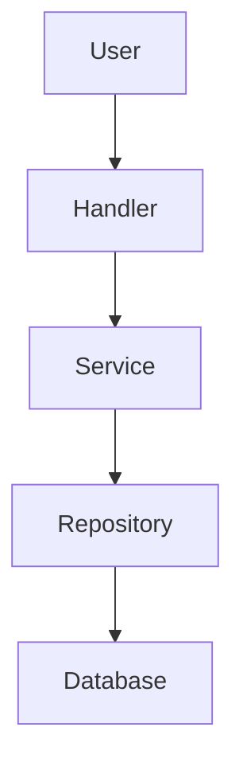

# Documentation Workflow

## Overview

This project uses a **Documentation Agent** to maintain comprehensive, up-to-date documentation in the `/docs` directory. This guide explains how to work with documentation in the project.

## Documentation Principles

1. **Single Source of Truth** - All documentation lives in `/docs`
2. **Always Current** - Documentation updated with code changes
3. **Comprehensive** - Architecture, API, guides, and development docs
4. **Developer-Friendly** - Easy to find and understand

## Documentation Structure

```
docs/
├── README.md                   # Documentation hub
├── architecture/               # System design
│   ├── system-overview.md     # Architecture overview
│   ├── database-schema.md     # Database documentation
│   ├── middleware-chain.md    # Middleware details
│   └── service-layer.md       # Service patterns
├── api/                       # API reference
│   ├── services.md            # Service APIs
│   ├── repositories.md        # Repository APIs
│   ├── handlers.md            # Handler reference
│   └── utilities.md           # Utility functions
├── guides/                    # User guides
│   ├── quickstart.md          # Quick start guide
│   ├── setup.md               # Setup instructions
│   ├── deployment.md          # Deployment guide
│   └── contributing.md        # Contribution guidelines
└── development/               # Developer docs
    ├── setup.md               # Dev environment
    ├── code-review.md         # Quality standards
    ├── testing.md             # Testing guide
    ├── migrations.md          # Migration workflow
    └── documentation-workflow.md  # This file
```

## Working with the Documentation Agent

### Invoking the Agent

The Documentation Agent can be invoked in several ways:

1. **Automatic**: Triggered when code changes are detected
2. **Manual**: Use `/docs` command in Claude Code
3. **Explicit**: Mention "documentation agent" or "update docs"

### When to Update Documentation

Documentation should be updated when:

- ✅ Adding new features or functionality
- ✅ Changing existing APIs (signatures, behavior)
- ✅ Modifying architecture or design patterns
- ✅ Updating dependencies or configuration
- ✅ Changing deployment procedures
- ✅ Fixing bugs that affect documented behavior
- ✅ Adding or changing security considerations

### What the Agent Does

The Documentation Agent will:

1. **Analyze Changes**: Review code modifications
2. **Identify Impact**: Determine which docs need updates
3. **Update Documentation**: Modify affected files
4. **Verify Links**: Check all cross-references
5. **Validate Examples**: Ensure code examples are correct
6. **Update Timestamps**: Mark when docs were last updated

## Manual Documentation Updates

### Adding New Documentation

1. **Choose Location**: Determine correct category (architecture/api/guides/development)

2. **Create File**: Use descriptive name (kebab-case)
   ```bash
   touch docs/guides/new-feature-guide.md
   ```

3. **Follow Template**:
   ```markdown
   # Document Title

   ## Overview
   Brief description of what this document covers.

   ## [Main Sections]

   ## Further Reading
   - [Related Doc 1](./related-doc-1.md)
   - [Related Doc 2](../api/related-api.md)

   ---

   **Last Updated**: YYYY-MM-DD
   **Maintained by**: Documentation Agent
   ```

4. **Update Index**: Add link to `docs/README.md`

5. **Commit**:
   ```bash
   git add docs/
   git commit -m "docs: Add new feature guide"
   ```

### Updating Existing Documentation

1. **Read Current Version**: Understand existing content

2. **Make Changes**: Edit the document

3. **Update "Last Updated"**: Change date at bottom

4. **Verify Links**: Ensure all links still work

5. **Test Examples**: Run any code examples

6. **Commit**:
   ```bash
   git add docs/
   git commit -m "docs: Update API reference for CardService"
   ```

## Documentation Standards

### File Naming

- Use **kebab-case**: `database-schema.md`, `api-reference.md`
- Be **descriptive**: `middleware-chain.md` not `middleware.md`
- Use **categories**: Place in correct subdirectory

### Markdown Style

```markdown
# Main Title (H1) - Only one per document

## Section (H2)

### Subsection (H3)

#### Minor Section (H4)

**Bold** for emphasis
*Italic* for slight emphasis
`code` for inline code
```

### Code Blocks

Always specify language:

````markdown
```python
# Good - language specified
def example():
    return True
```

```
# Bad - no language
def example():
    return True
```
````

### Links

**Internal links** (same repo):
```markdown
[System Overview](./architecture/system-overview.md)
[API Reference](../api/services.md)
```

**External links**:
```markdown
[Python Docs](https://docs.python.org/)
[aiogram](https://docs.aiogram.dev/)
```

**Heading links**:
```markdown
[Jump to Section](#section-name)
```

### Tables

Use tables for structured data:

```markdown
| Column 1 | Column 2 | Column 3 |
|----------|----------|----------|
| Value 1  | Value 2  | Value 3  |
| Value 4  | Value 5  | Value 6  |
```

### Code Examples

**Good Example** - Complete and runnable:
```python
from bot.services.deck_service import DeckService
from sqlalchemy.ext.asyncio import AsyncSession

async def create_deck_example(session: AsyncSession, user_id: int):
    """Create a new deck for a user."""
    deck_service = DeckService(session)
    deck = await deck_service.create_deck(
        user_id=user_id,
        name="Greek Basics",
        description="Essential Greek vocabulary"
    )
    return deck
```

**Bad Example** - Missing context:
```python
# Missing imports, unclear where this runs
deck = service.create_deck(name="Greek Basics")
```

### Diagrams

Use ASCII diagrams for simple visualizations:

```
┌─────────────┐
│   Handler   │
└─────────────┘
       ↓
┌─────────────┐
│   Service   │
└─────────────┘
       ↓
┌─────────────┐
│ Repository  │
└─────────────┘
```

For complex diagrams, use Mermaid:

````markdown

````

## Documentation Review Process

### Before Committing

Check the following:

- [ ] All code examples are tested and working
- [ ] Links to other docs are valid
- [ ] Version information is current
- [ ] Prerequisites are clearly listed
- [ ] Common errors are documented
- [ ] Related documentation is cross-referenced
- [ ] Last Updated timestamp is set
- [ ] Examples follow project code style
- [ ] Grammar and spelling are correct
- [ ] No sensitive information (tokens, passwords)

### Verification Commands

```bash
# Check for broken links (manual review)
find docs -name "*.md" -exec grep -H "](.*\.md)" {} \;

# List all documentation files
find docs -name "*.md" -type f

# Search for specific term
grep -r "search term" docs/

# Count documentation files
find docs -name "*.md" | wc -l
```

## Common Documentation Tasks

### Documenting a New Service

1. **Add to API Reference** (`docs/api/services.md`):
   ```markdown
   ## NewService

   **File**: `bot/services/new_service.py`

   ### Purpose
   Description of what this service does.

   ### Methods

   #### `method_name(param1, param2) -> ReturnType`
   Description of method.

   **Parameters**:
   - `param1` (Type): Description
   - `param2` (Type): Description

   **Returns**: Description

   **Example**:
   ```python
   service = NewService(session)
   result = await service.method_name("value", 123)
   ```
   ```

2. **Update Architecture** (`docs/architecture/service-layer.md`)

3. **Add Usage Guide** (if needed in `docs/guides/`)

### Documenting a Database Change

1. **Update Schema Doc** (`docs/architecture/database-schema.md`)
2. **Document Migration** (`docs/development/migrations.md`)
3. **Update API if needed** (`docs/api/repositories.md`)

### Documenting Configuration Changes

1. **Update Setup Guide** (`docs/guides/setup.md`)
2. **Update `.env.example`** in project root
3. **Note in Deployment Guide** (`docs/guides/deployment.md`)

## Documentation Agent Configuration

The agent is configured in `.claude/agents/documentation-agent.md`.

### Agent Capabilities

- **Read**: Examine code and existing docs
- **Write**: Create new documentation
- **Edit**: Update existing documentation
- **Glob/Grep**: Find files and patterns
- **Bash**: Run verification scripts

### Agent Triggers

Automatically triggered by:
- Code commits with significant changes
- New files in `bot/` directory
- Changes to models, services, or handlers
- Configuration updates

### Manual Invocation

```
@documentation-agent please update the API docs for CardService
```

Or use Claude Code command:
```
/docs update service CardService
```

## Best Practices

### 1. Document as You Code

Don't wait until the end - update docs with code changes:
```bash
# ✅ Good - docs in same commit
git add bot/services/new_service.py docs/api/services.md
git commit -m "feat: Add NewService with documentation"

# ❌ Bad - docs separate or missing
git add bot/services/new_service.py
git commit -m "feat: Add NewService"
```

### 2. Keep It DRY (Don't Repeat Yourself)

Link to code docstrings instead of duplicating:
```markdown
For detailed parameter information, see the [CardService class](../../bot/services/card_service.py).
```

### 3. User-First Perspective

Write from the user's point of view:
```markdown
# ✅ Good - user perspective
To create a new deck, call `create_deck()` with user ID and deck name.

# ❌ Bad - implementation detail
The create_deck method instantiates a Deck model and persists it via the repository.
```

### 4. Provide Context

Don't assume knowledge:
```markdown
# ✅ Good - provides context
The SM-2 algorithm is a spaced repetition algorithm that calculates optimal
review intervals based on how well you remembered the card.

# ❌ Bad - assumes knowledge
SM-2 calculates intervals.
```

### 5. Show, Don't Just Tell

Use examples:
```markdown
# ✅ Good - shows example
```python
# Get cards due for review
due_cards = await card_service.get_due_cards(deck_id)
```

# ❌ Bad - only describes
The get_due_cards method returns cards that are due for review.
```

## Troubleshooting

### Documentation Out of Sync

If documentation doesn't match code:

1. Invoke documentation agent: `/docs verify`
2. Check recent code changes: `git log --oneline -20`
3. Manually update affected docs
4. Run verification: Compare code vs docs

### Broken Links

Find and fix broken links:

```bash
# Find all markdown links
grep -r "](.*\.md)" docs/

# Manually verify each link points to existing file
```

### Missing Documentation

If documentation is missing for a feature:

1. Check if feature is actually used (grep codebase)
2. Determine correct location in `/docs`
3. Create documentation following templates
4. Update indexes and cross-references

## Integration with Development Workflow

### Pull Request Checklist

- [ ] Code changes are complete
- [ ] Tests are passing
- [ ] Documentation is updated
- [ ] Examples are tested
- [ ] Links are valid
- [ ] PR description references doc updates

### Continuous Integration

Documentation checks (future):
- Verify links are not broken
- Check all code examples compile
- Ensure formatting is consistent
- Validate structure

## Further Reading

- [Code Review Standards](./code-review.md) - Quality standards
- [Contributing Guide](../guides/contributing.md) - How to contribute
- [System Overview](../architecture/system-overview.md) - Architecture

---

**Last Updated**: 2026-01-20
**Maintained by**: Documentation Agent
